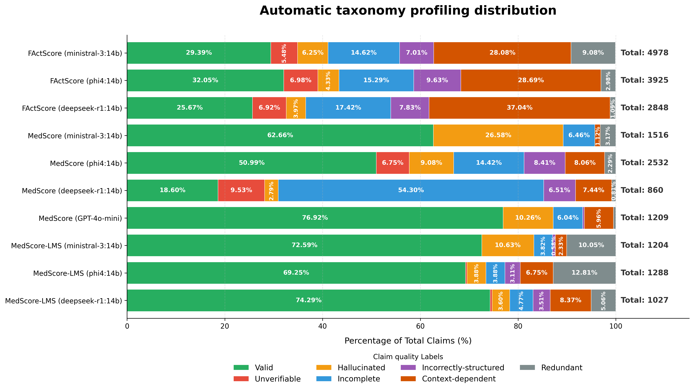

# MedScore-LMS
# MedScore with Small Language Models

**Official implementation** for the study *Towards Reliable Evaluation of Factuality in Long-Form Text Generated by LLMs*.

---

## Abstract

Decompose-then-verify is a standard paradigm for evaluating factuality in long-form generation, but in free-form medical answers the final score is often dominated by claim decomposition quality—small models frequently produce taxonomy-violating claims (e.g., context-dependent or incomplete), which then injects noise into verification and makes scores unstable. Building on **[MedScore](https://arxiv.org/abs/2505.18452)**’s medical decomposition taxonomy, we propose MedScore-LMS, a lightweight extension designed for enterprise-friendly, self-hosted small language models: it performs taxonomy-guided claim classification, applies normalization to fixable invalid categories (Incorrectly-structured, Context-dependent, Incomplete), re-classifies the corrected claims, and verifies only the valid-claim set to ensure the score reflects response factuality rather than decomposition artifacts. We evaluate on 100 AskDocsAI long-form doctor replies and run decomposition/normalization on three self-hosted 14B models (ministral-3:14b, phi4:14b, deepseek-r1:14b), using a stronger self-hosted model for taxonomy labeling. MedScore-LMS stabilizes decomposition density to ≈1.46–1.71 claims/sentence and substantially improves validity, achieving 69.25\%–74.29\% Valid rate (e.g., reducing deepseek-r1:14b Incomplete from 54.30\% to 4.77\%), while producing high valid-only factuality scores of 0.9166–0.9387, narrowing the gap to proprietary settings under cost and privacy constraints. The code is available at https://github.com/ThatPham2000/medscore-lms.

**Keywords:** Medical factuality evaluation; Decompose-then-verify; Small language models; Hallucination; Long-form medical question answering; Self-hosted LLM; Atomic facts decomposition; MedScore taxonomy; Interpretability; Enterprise privacy

---

## Requirements

- **Python 3** (version consistent with your environment; see `requirements.txt`)
- **spaCy English model** for sentence segmentation (`en_core_web_sm`), used by [`utils.parse_sentences`](med-score-small-llm/utils.py)
- At least one of:
  - **[Ollama](https://ollama.com/)** with your chosen models pulled locally (e.g., `ministral-3:14b`, `phi4:14b`, `deepseek-r1:14b`), or
  - **OpenAI-compatible HTTP endpoint** plus API key for remote inference

---

## Installation
1. Clone the repository:
```bash
git clone https://github.com/ThatPham2000/medscore-lms.git
```

2. Install dependencies:
```bash
cd /path/to/medscore-lms
pip install -r requirements.txt
```

3. Install dependencies and the spaCy model:
```bash
python -m spacy download en_core_web_sm 
```

---

## Running the pipeline

[`med_score_small_llm.py`](med-score-small-llm/med_score_small_llm.py) orchestrates:

1. **Decomposition** — sentence splitting (spaCy) + claim extraction  
2. **Claim quality evaluation** — MedScore taxonomy labeling, optional normalization and re-classification  
3. **Verification** — factuality scoring of valid claims only (internal LLM or provided evidence)

### Full run (decompose → claim quality → verify)

```bash
python med_score_small_llm.py \
  --input_file /path/to/responses.jsonl \
  --output_dir /path/to/out \
  --decomposition_mode small_llm \
  --decomposition_llm_provider ollama \
  --decomposition_model_name deepseek-r1:14b \
  --claim_quality_evaluation_llm_provider ollama \
  --claim_quality_evaluation_model_name gpt-oss:20b \
  --verification_mode provided \
  --verification_llm_provider ollama \
  --verification_model_name gpt-oss:20b \
  --provided_evidence_path /path/to/evidence.jsonl
```

Optional: `--decomposition_server`, `--verification_server`, `--claim_quality_evaluation_server` for remote hosts; use `--decomposition_llm_provider openai` (and analogous flags) with `--openai_api_key` and a valid `--decomposition_server` base URL when using OpenAI-compatible APIs.

### Staged runs

- **Decomposition only:** `--decompose_only`  
- **Claim quality only:** `--evaluate_claim_quality_only` with `--decomposition_input_file` pointing to existing decompositions  
- **Verification only:** `--verify_only` with `--valid_decomposition_input_file`  

### Decomposition modes

`--decomposition_mode` ∈ `small_llm` | `medscore` | `factscore`.

### Verification modes

`--verification_mode` ∈ `internal` | `provided` (with `--provided_evidence_path`).

> **Note:** The `__main__` block in `med_score_small_llm.py` may slice the dataset (e.g., a fixed index range) for experiments. For full-corpus evaluation, adjust or remove that slice in your fork.

---

## Main results

All numbers below are on **AskDocsAI** (**100** long-form samples). Standard deviations are shown in parentheses where applicable.

### Decomposition claim statistics

**Table — Claim counts after decomposition.** For **MedScore-LMS**, we report **post re-classification** outputs, i.e. the final claim set passed to verification. **0-claim rates are 0.00** for all methods.

| Method | #claims/response | #claims/sentence |
|--------|------------------|------------------|
| FActScore (ministral-3:14b) | 49.78 (±17.82) | 7.51 (±2.98) |
| FActScore (phi4:14b) | 39.25 (±15.25) | 5.92 (±1.79) |
| FActScore (deepseek-r1:14b) | 28.48 (±12.16) | 4.30 (±3.37) |
| MedScore (ministral-3:14b) | 15.16 (±5.78) | 2.29 (±1.45) |
| MedScore (phi4:14b) | 25.32 (±9.99) | 3.82 (±2.53) |
| MedScore (deepseek-r1:14b) | 8.60 (±3.09) | 1.30 (±0.69) |
| MedScore (GPT-4o-mini) | 11.95 (±4.43) | 1.77 (±1.17) |
| MedScore-LMS (ministral-3:14b) | 8.74 (±4.16) | 1.71 (±1.08) |
| MedScore-LMS (phi4:14b) | 8.92 (±4.17) | 1.58 (±1.18) |
| MedScore-LMS (deepseek-r1:14b) | 7.63 (±3.60) | 1.46 (±0.97) |

### Final factuality scores (MedScore-LMS)

**Table — MedScore-LMS scores on 100 AskDocsAI samples.** Evaluation uses the **original doctor answers** from the dataset as **reference evidence** when verifying generated medical claims.

| Method | Score | Standard deviation |
|--------|-------|----------------------|
| MedScore-LMS (ministral-3:14b) | 0.9381 | 0.0991 |
| MedScore-LMS (phi4:14b) | 0.9166 | 0.1117 |
| MedScore-LMS (deepseek-r1:14b) | 0.9387 | 0.1156 |

### Claim-quality taxonomy (automatic profiling)

Automatic taxonomy profiling across decomposition frameworks shows that **MedScore-LMS** substantially increases the **Valid** claim rate for small language models, bringing it closer to **GPT-4o-mini** under the same MedScore taxonomy.



---

## Citation

If you use this code or the associated study, please cite the **paper**.

```bibtex
// Placeholder BibTeX entry for the paper
```

---

## License

This project is released under the [MIT License](LICENSE) (Copyright © 2025 PHẠM VĂN THẬT).

---

## Disclaimer

This software is intended for **research and evaluation**. It does not provide medical advice. Clinical use requires independent validation, appropriate governance, and human oversight.